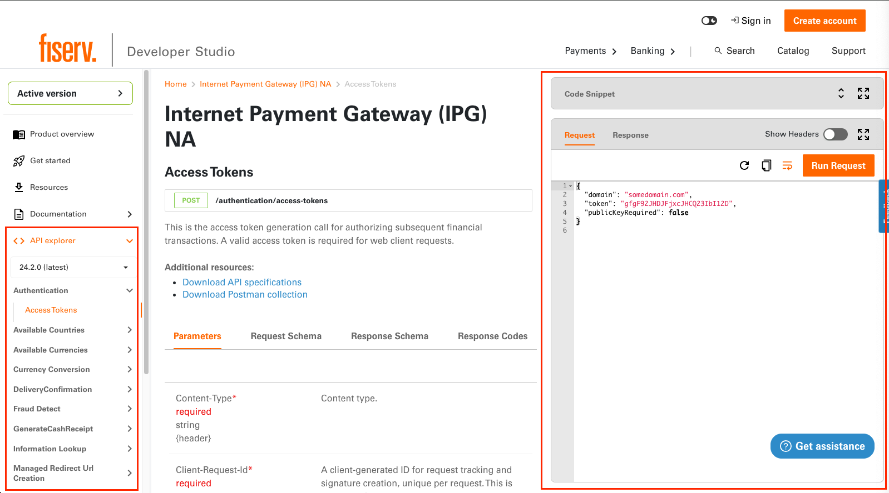
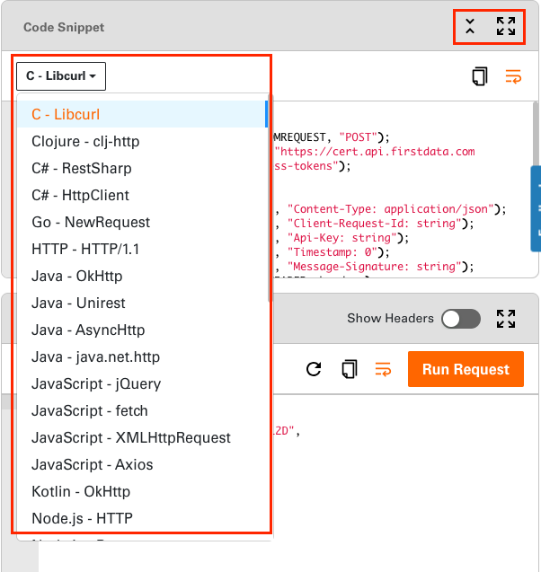
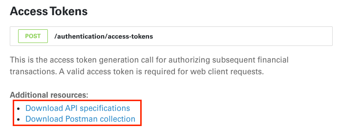

# API Explorer

On the API Explorer page a Developer can view endpoint URL, request, response schema, response codes.

The Runbox on the right side of the page allows a Developer to view an end-point request and response payloads in convenient JSON format. 
It also supports experimentation by allowing a developer to edit request payload and visualize the results.

Another feature of the Runbox is the generation of code snippets in a variety of programming languages.

API Explorer supports the ability to download API specification in openapi 3.0 format and as Postman collection.

## OpenAPI Specification

> Developer Studio supports OpenAPI Specification Version 3.0 and above

The OpenAPI Specification (OAS) defines a standard, language-agnostic interface to RESTful APIs which allows both humans and computers to discover and understand the capabilities of the service without access to source code, documentation, or through network traffic inspection. When properly defined, a consumer can understand and interact with the remote service with a minimal amount of implementation logic. 
Refere to [Swagger](https://swagger.io/specification/) for more information on OpenAPI Specification.

OpenAPI Document (or set of documents) defines or describes an API. An OpenAPI definition uses and conforms to the OpenAPI Specification.

       "apiVersions": [
          {
            "version": "11.0.0",
            "versionType": "major",
            "releaseNotesPath": "/release-notes/release-notes-11.0.0.md",
            "apiSpecFileNames": [        
              "Accountholder/AddrAdd",
              "Accountholder/AddrDel",
              ...
            ]
          }
        ],

In the `apiversions` array, you may list any number of API versions you support on your product. Each version will pull the API spec yamls from their respective version number (i.e. version `11.0.0` will pull files from `reference/11.0.0/` with each file/subdirectory being indicated in `apiSpecFileNames`). 

Each product can only have one `versionType: 'major'` but can list as many `minor` versions for archiving or tracking older versions as needed.

For each API version, we require a separate `releaseNotesPath` to have updated release notes available for any customers to view in cases of API updates as to prevent unexpected business disruptions.

There is no limit on how many spec files/APIs you can list under a certain version. It is advisable to split APIs into categories/separate files for easy handling by other team members of your product in the future plus ease of indexing/debugging spec in case of misconfiguration. Any spec file not listed under `apiSpecFileNames` will **not** be indexed and shown on Developer Studio. You can use this functionality to have API spec files that are *hidden* to be viewed only by your team members on Github.

### OpenAPI Document Structure

It is required that OpenAPI document follows [JSON Schema](https://json-schema.org/)

An OpenAPI document MAY be made up of a single document or be divided into multiple, connected parts at the discretion of the user.
Sample of 

       openapi: 3.0.0
       info:
         title: Address Service - Add
         description: The Address service manages addresses related to parties and product accounts.
         version: 11.0.0
       servers:
       - url: /
       paths:
         /address:
           post:
              tags:
              - Add Address
              summary: Add Address
              description: ""
              operationId: addAddress
              parameters:
              requestBody:
              responses:
                "201":
              deprecated: false
              x-group-name: Address Service
              x-proxy-name: Add Address
              x-child-product-name: Accountholder

Last three fields are used to group API end-points into meaningful categories, where

              x-proxy-name: API end-point name
              x-group-name: API end-point group
              x-child-product-name: parent group of API end-point group
              

[Enable Sandbox](enable-sandbox.md)

### Default Example

Enhance experience for tenants so they can set default example that can be viewed in runbox by default.

