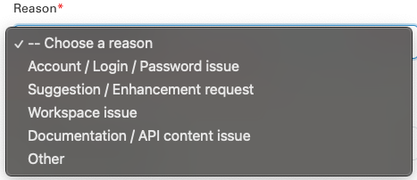
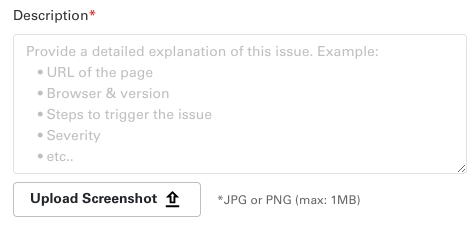
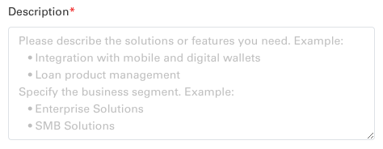
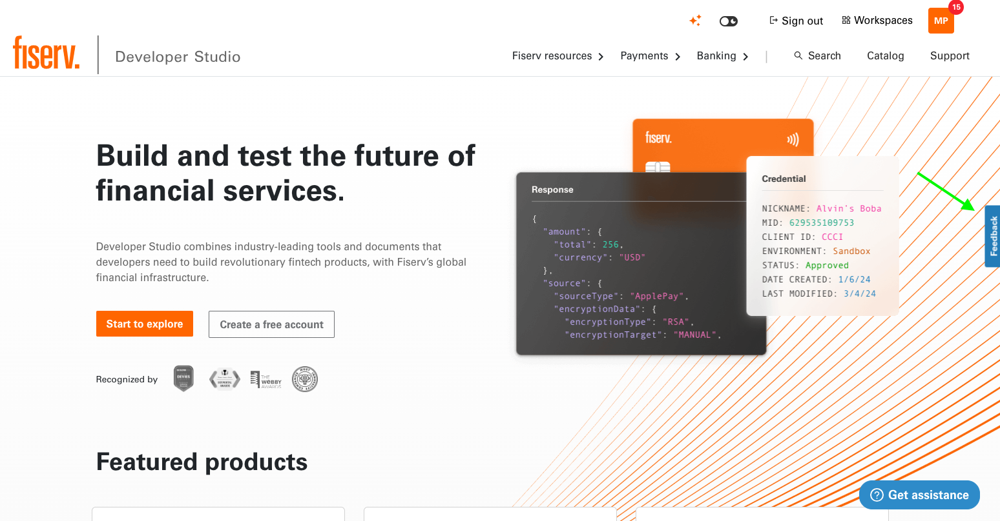

# Get Support

The Developer Studio team has Teams channels for tenants to ask questions and provide feedback. They are *General* and *Feedback & Help!*

In addition, every Developer Studio page has a **Get Assistance** button in the bottom right corner.

When expanded **Help Center** contains links to various help resources.

## Client 360 Inquiry
While this is generally used by non-Fiserv internal customers, we also have a Client 360 flows for submitting questions regarding various issues with documentation, API functionality, account functionality, etc. We will document their intended usage and process here for understanding and for you to relay to customers as needed.

This Client 360 inquiry will be responded by our on-call support team, either via a response email or forwarded to the appropriate tenant/product team to do the same.

  1. Sign into DevStudio (or create account as needed). This provides us a callback email to reply.
  2. Choose either `Create an issue` or `Contact sales` (for intergration request) depending on the nature of the inquiry
  
### Create an issue

  * Reason: Pick a reason from the list depending on the issue you're facing
    

  * Product: Pick the product from the list where you're having the issue (Developer Studio is the default for people looking for generic help, though we'll usually tell them to use our Search tool and close the ticket unless given more information)
    

  * Description: More information about the issue to help us direct the inquiry to the correct point of contact for efficient and accurage resolution.
    

### Contact sales

  * Product: Pick the product from the list that you want to get integration help with (`Others` is the default for people who aren't sure, though we'll usually tell them to use our Search tool or the official Fiserv form at https://www.fiserv.com/en/about-fiserv/contact-us.html)
    

  * Description: More information about your business and the solution needed to quickly get a response for the API and services support you need.
    

## Github support
To create an issue you need a github account and access to our [Github Support page](https://github.com/Fiserv/Support/issues)

  1. Go to Support and click on **New Issue**
  
    
  
  2. Select issue type: Bug report, Feature request, Feedback
  
  
  
  3. Add label(s)
  
    
  
  * If the issue is with the specific product, add product label as well. Then the issue will be send to the assignee under support config in tenant.json
  
    
   
  ### Setting Priority and Severity for any Issue

    

#### Priority
Priority defines the order in which we should resolve a defect.  

##### DEFECT PRIORITY CLASSIFICATION.

**High:** Must be fixed in any of the upcoming builds but should be included in the release. 

**Medium:** May be fixed after the release / in the next release. 

**Low:** May or may not be fixed at all.

**Severity:** It is the extent to which the defect can affect the software. In other words, it defines the impact that a given defect has on the system.

##### DEFECT SEVERITY CLASSIFICATION 

**Critical:** The defect affects critical functionality or critical data. It does not have a workaround. Example: Unsuccessful installation, complete failure of a feature. 

**Major:** The defect affects major functionality or major data. It has a workaround but is not obvious and is difficult. Example: A feature is not functional from one module but the task is doable if 10 complicated indirect steps are followed in another module/s. 

**Minor:** The defect affects minor functionality or non-critical data. It has an easy workaround. Example: A minor feature that is not functional in one module but the same task is easily doable from another module. 

**Trivial:** The defect does not affect functionality or data. It does not even need a workaround. It does not impact productivity or efficiency. It is merely an inconvenience. Example: Petty layout discrepancies, spelling/grammatical errors.

## Feedback
If you have any other feedback, concerns, or compliments, please feel free to use the `Feedback` button on DevStudio or reach out to us on Teams directly! We love to receive all your inputs for our engineers to continue improving the platform for everyone.

